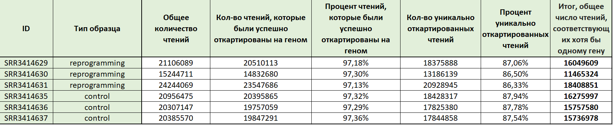
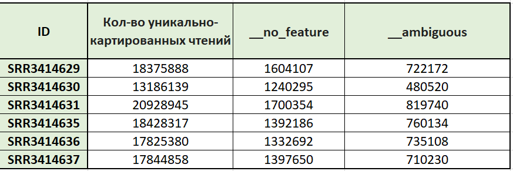
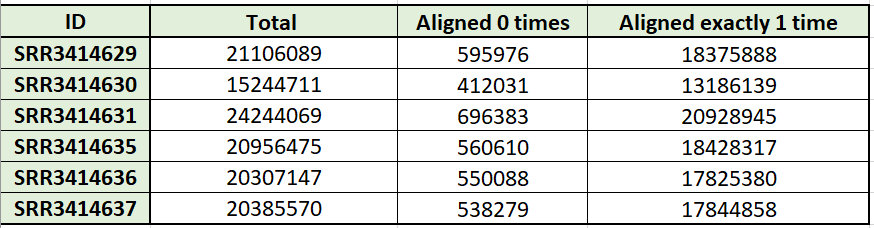
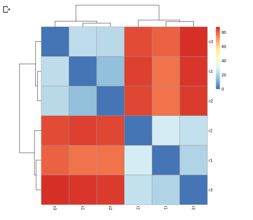
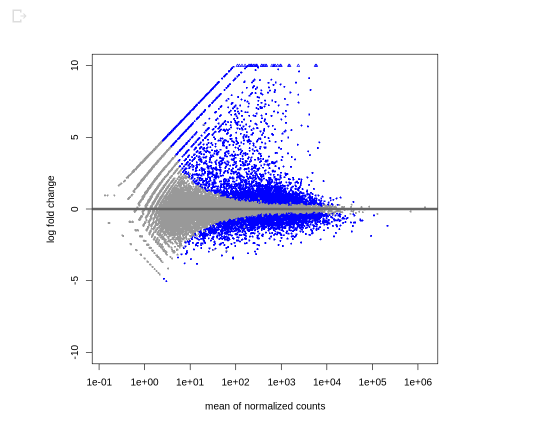
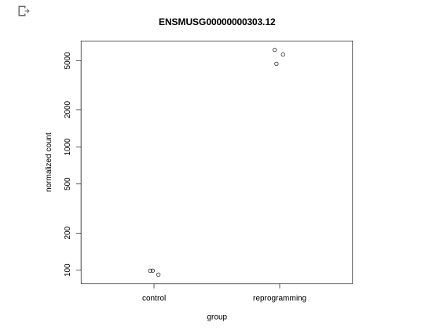
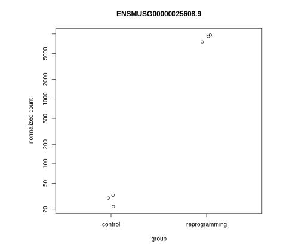
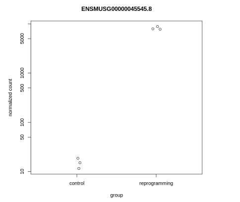
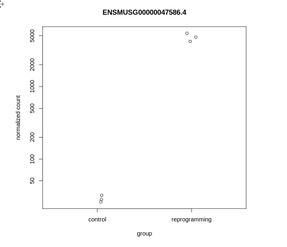
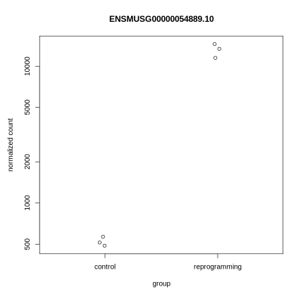

# hse21_hw3
____

## ЧАСТЬ 1
**Ссылка на первую часть в Google collab**

https://colab.research.google.com/drive/1hAlH6EoUQiw3hfVtmPA5CpmFifw2dwQb?usp=sharing
____

## Скриншоты FastQC

### SRR3414629

____

### SRR3414630

____

### SRR3414631

____

### SRR3414635

____

### SRR3414636

____

### SRR3414637

____

## Таблицы

### Таблица со статистикой по каждому из 6-ти образцов

### Вспомогательная таблица 1

### Вспомогательная таблица 2

____

## ЧАСТЬ 2
Ссылка на вторую часть в Google collab

https://colab.research.google.com/drive/1REucGbCWtC9Ml7QE6gXeW6j09EmiMk7s?usp=sharing

### Тепловая карта

### MA-plot

### Пять графиков по наиболее значимо поменявшимся свою экспрессию генам

